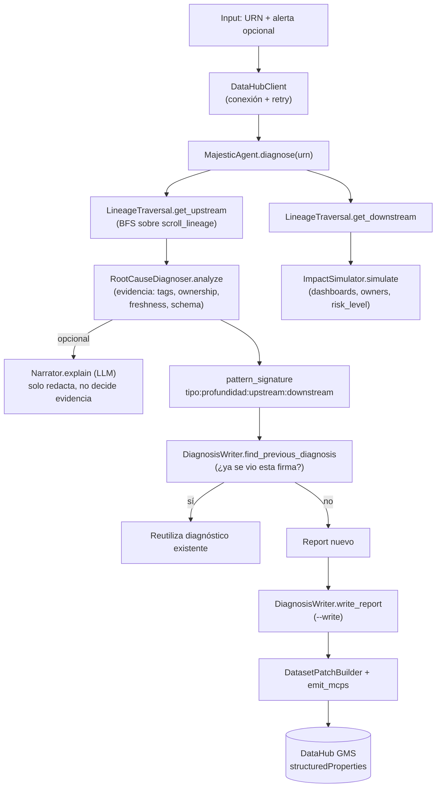

# PROPOSAL.md — Propuesta técnica para Majestic antes de la demo

> Documento de análisis. No implementa nada — es para que decidas qué aprobar antes de tocar código de nuevo.

---

## 1. Estado actual del proyecto

### Qué está bien diseñado

- **Fail-fast de conexión, sin excepciones.** Toda clase que depende de DataHub (`LineageTraversal`, `RootCauseDiagnoser`, `DiagnosisWriter`, `ImpactSimulator`) revisa `client.is_connected` en su propio `__init__` y lanza `RuntimeError` de inmediato. Nadie queda construido a medias. Es el tipo de disciplina que evita bugs de "se rompió tres llamadas después, en un lugar sin contexto del error real".
- **Un solo traversal, dos direcciones.** `LineageTraversal` es el único módulo que toca `scroll_lineage`; `RootCauseDiagnoser` lo consume hacia upstream y `ImpactSimulator` hacia downstream. No hay dos implementaciones de BFS paralelas que puedan divergir — justo lo que `proyecto-majestic.md` promete ("mismo mecanismo invertido").
- **Retry acotado a lo idempotente.** El retry de `tenacity` en `client.py` envuelve *solo* la conexión inicial, no `emit_mcps` ni ninguna escritura. Fue una decisión deliberada: reintentar una escritura sin saber si el primer intento sí llegó es la forma clásica de introducir duplicados o inconsistencia. Es una restricción correcta, no un olvido — pero vale la pena que lo sepas explícitamente para el punto 3.4 más abajo.
- **La cadena causal tiene una condición de corte real, no un límite arbitrario.** `RootCauseDiagnoser` no "junta las 3 mejores evidencias que encuentre" — recorre hop por hop y se detiene apenas un salto no aporta evidencia. Eso es lo que hace que la salida sea defendible: cada eslabón que aparece en pantalla tiene un dato concreto detrás, nunca un "creemos que".
- **Tests con `spec=DataHubClient`.** El mock en `conftest.py` usa `spec=`, no un `MagicMock()` pelado — si alguien renombra un atributo real de `DataHubClient`, los tests fallan por `AttributeError` en vez de pasar silenciosamente contra una interfaz que ya no existe.

### Qué partes ya son defendibles técnicamente

- El traversal BFS multi-hop con deduplicación (`visited` set) — maneja grafos con ciclos y diamantes sin recomputar ni loopear infinito.
- La separación `write_report` (booleano limpio para el flujo normal) vs. el spike script (patch crudo + traceback completo) — dos audiencias distintas para el mismo mecanismo, cada una con la interfaz que necesita.
- Los 24 tests corren contra el SDK real instalado (no contra un doble hecho a mano), así que al menos la superficie de la API que usamos (firmas, nombres de clase, comportamiento del patch builder) está confirmada, no asumida.

### Qué código ya parece de nivel senior

`src/graph/traversal.py` es, para mí, el archivo más sólido del repo: la función `_one_hop` resuelve correctamente el caso ambiguo de "¿cuál de los dos extremos del edge es el nodo ancla?" comparando contra `source_urn`/`destination_urn` crudos en vez de confiar en `upstream_urn`/`downstream_urn` ya resueltos por el SDK (que dependen de una semántica de `isUpstream` que no pude verificar empíricamente). Es la clase de decisión que solo se toma cuando se leyó el código fuente del SDK, no solo la documentación.

---

## 2. Riesgos reales

### Qué puede fallar en una demo en vivo

1. **El dataset de demo no tiene ninguna anomalía real.** Este es, para mí, el riesgo más alto de todo el proyecto — y nadie lo mencionó en las dos iteraciones anteriores. Si `SampleHiveDataset` (u otro dataset del datapack por defecto) no tiene un dataset upstream sin owner, con un tag de incidente, o con schema tocado recientemente, `main.py diagnose` va a devolver `root_cause_urn: null`, `pattern_signature: "unknown:0:X:Y"`, cadena causal vacía. En vivo, eso se lee como "el agente no encontró nada" — indistinguible de "el agente no funciona" para un jurado que no conoce el código.
2. **`find_previous_diagnosis` puede fallar silenciosamente.** Ya está documentado en el README, pero vale repetirlo acá porque es un riesgo de *demo*, no solo de código: si el nombre del campo de búsqueda de Elasticsearch no es el asumido, la función devuelve `None` sin ningún error visible. Si la demo depende de mostrar "♻️ ya vi este patrón antes", y eso no aparece, no hay forma de saber en el momento si es porque de verdad no hay coincidencia o porque el filtro está mal.
3. **Sin timeout explícito en `DatahubClientConfig`.** Si el GMS responde lento (por ejemplo, quickstart recién levantado, todavía indexando), una llamada puede colgar mucho más de lo que dura una pausa incómoda en una demo. Hoy no hay ningún límite de tiempo propio configurado.
4. **Tres pasos manuales antes de poder correr el agente** (`spike_test.py`, `datahub properties upsert`, `scripts/spike_writeback_test.py`) — cada paso manual en vivo es una oportunidad de fumble (olvidar un paso, correrlo en el orden equivocado, no notar que uno falló).
5. **Falta de "modo presentación" en la salida.** `main.py` hoy mezcla `logger.info` (con timestamps y emojis) y `print()` de JSON crudo. Funciona, pero no está pensado para que alguien lo lea desde la fila del jurado en una pantalla compartida.

### Qué dependencias no están validadas con DataHub real

- `DataHubGraph.scroll_lineage` — el método y la firma están confirmados, pero **nunca corrió contra un grafo real de más de un hop**. La lógica de paginación (`scroll_id`) tampoco se ejercitó nunca con una respuesta real de más de una página.
- `DatasetPatchBuilder.add_structured_property` + `emit_mcps` — confirmado que arma el patch JSON correctamente, pero nunca confirmado que DataHub *acepta* ese patch (¿el path `/properties/urn:li:structuredProperty:.../` es exactamente el que el aspect resolver espera? Es razonable que sí, pero "razonable" no es "probado").
- `get_urns_by_filter` con `extraFilters` sobre `structuredProperties.<qualifiedName>` — el mayor riesgo del proyecto, ya cubierto en el README, pero quiero que quede claro que es una **suposición sobre el mapping de búsqueda de DataHub**, no sobre el SDK de Python.

### Qué tests todavía no cubren el riesgo suficiente

- **Ningún test ejercita la paginación real de `scroll_lineage`.** Todos los mocks en `test_traversal.py` devuelven `scroll_id=None` en la primera respuesta — el `while True` / `if scroll_id is None: break` en `_one_hop` nunca se probó con una segunda vuelta de loop. Si hay un bug ahí (por ejemplo, un loop infinito si `scroll_id` nunca se vuelve `None`), los tests no lo van a atrapar.
- **Ningún test integration-level contra una instancia real.** Es una limitación estructural, no un descuido — no hay DataHub corriendo en este entorno — pero significa que "24/24 tests pasan" prueba que la lógica interna es consistente, no que el sistema funciona de punta a punta.
- **Nada valida que el JSON que arma `DatasetPatchBuilder` sea aceptado por el aspect resolver de DataHub.** Los tests de `test_writer.py` confirman que se llama a `emit_mcps` con el payload esperado — no confirman que ese payload es válido desde el punto de vista del servidor.

---

## 3. Propuestas de mejora

Ordenadas por impacto real sobre el resultado de la demo, no por prolijidad de código.

### 3.1 — Seed/fixture de datos de demo con anomalía garantizada
- **Qué mejorar:** un script (`scripts/seed_demo_data.py`) que ingesta vía SDK un mini-grafo sintético: 3-4 datasets encadenados, con un tag de incidente o un owner vacío en algún punto upstream, y al menos un dashboard downstream. Se corre una vez contra el quickstart antes de grabar.
- **Por qué importa:** es el único ítem de esta lista que decide si la demo tiene algo interesante que mostrar o no. Todo lo demás (memoria, impact simulator, retry) es invisible si `diagnose` devuelve una cadena vacía.
- **Dónde tocaría el código:** archivo nuevo en `scripts/`, reutiliza `DataHubClient` y clases de `datahub.emitter` para emitir `UpstreamLineageClass`, `GlobalTagsClass`, `OwnershipClass` sobre URNs sintéticos.
- **Riesgo de implementación:** bajo — es aditivo, no toca nada existente.
- **Prioridad: crítica.**

### 3.2 — Validar (o tener plan B para) `find_previous_diagnosis`
- **Qué mejorar:** correr `scripts/spike_writeback_test.py` contra la instancia real y, si el filtro de búsqueda falla, tener un plan B ya escrito: reemplazar `extraFilters` por un `query=` de texto libre sobre el valor de la property, o directamente por un scroll manual de todos los datasets del datapack de demo (son pocos) filtrando en Python.
- **Por qué importa:** es la única feature de todo el proyecto que puede fallar en silencio (devuelve `None`, no una excepción) — el peor tipo de bug para una demo en vivo.
- **Dónde tocaría el código:** `src/memory/writer.py::find_previous_diagnosis`, con fallback opcional detrás de un flag en `config/settings.py`.
- **Riesgo de implementación:** medio — depende de qué tan mal esté la suposición original; en el peor caso es reescribir la función.
- **Prioridad: crítica.**

### 3.3 — Comando `doctor` en `main.py`
- **Qué mejorar:** `python3 main.py doctor` que corre, en un solo comando, lo que hoy son tres scripts separados (conexión, property yaml aplicado, ciclo de write-back), y termina con un resumen tipo checklist (✅/❌ por ítem).
- **Por qué importa:** reduce de 3 comandos manuales a 1 el ritual pre-demo, y baja la chance de que alguien se salte un paso sin darse cuenta bajo presión de horario.
- **Dónde tocaría el código:** nuevo subcomando en `main.py`, reutiliza `DataHubClient`, `DiagnosisWriter` y la lógica ya escrita en `scripts/spike_writeback_test.py` (que podría quedar como el cuerpo de este comando, en vez de un script aparte).
- **Riesgo de implementación:** bajo — es composición de piezas que ya existen y funcionan.
- **Prioridad: crítica.**

### 3.4 — Capa de síntesis narrativa opcional con LLM
- **Qué mejorar:** hoy `RootCauseDiagnoser` es 100% determinístico — cero llamadas a un LLM en todo el pipeline. Propongo agregar un paso *opcional* y *aislado*: tomar la `causal_chain` ya construida (evidencia real, ya verificada) y pedirle a un LLM que la redacte en lenguaje natural para el humano ("el reporte de ventas está vacío porque hace 3 horas se modificó el schema de `marketing_raw`, tres saltos upstream, y nadie es owner del dataset intermedio"). El LLM nunca decide *qué* es evidencia ni inventa eslabones — solo redacta sobre hechos ya extraídos del grafo.
- **Por qué importa:** esto es un *Agent Hackathon*. Tal como está hoy, si un jurado técnico pregunta "¿dónde está el agente/LLM acá?", la respuesta honesta es "no lo hay, es una heurística de reglas". Eso no invalida el proyecto (de hecho, `proyecto-majestic.md` ya dice explícitamente "no especulación del LLM" como diferenciador), pero conviene decidir a propósito si esa es la historia que quieren contar, o si suman una capa de síntesis que hace el output más legible sin tocar el principio de "cero alucinación sobre los hechos".
- **Dónde tocaría el código:** nueva función `explain(causal_chain) -> str` en `src/core/diagnoser.py` o un módulo nuevo `src/core/narrator.py`, invocada opcionalmente desde `main.py` detrás de un flag `--explain`. No toca la lógica de evidencia existente.
- **Riesgo de implementación:** medio — agrega una dependencia externa (API de LLM) y con eso un nuevo punto de falla en vivo; debe tener su propio fallback silencioso a la salida determinística si la llamada falla.
- **Prioridad: alta.**

### 3.5 — Timeouts explícitos y manejo de error legible para URN inválido
- **Qué mejorar:** setear `timeout_sec` en `DatahubClientConfig` (ya existe el campo, no está seteado), y capturar el caso "URN no existe" en `main.py` con un mensaje humano en vez de dejar que se propague lo que devuelva el SDK.
- **Por qué importa:** dos formas muy probables de que la demo se vea mal en vivo son "se quedó colgado" y "tiró un traceback ilegible al tipear mal un URN".
- **Dónde tocaría el código:** `src/graph/client.py` (agregar `timeout_sec` al `DatahubClientConfig`), `main.py` (try/except alrededor de `agent.diagnose`/`simulator.simulate` con mensaje claro).
- **Riesgo de implementación:** bajo.
- **Prioridad: alta.**

### 3.6 — Modo de salida limpio para pantalla
- **Qué mejorar:** flag `--quiet` en `main.py` que suprime los logs de `logging` (dejando solo el JSON final formateado, o una versión resumida legible) para cuando se comparte pantalla.
- **Por qué importa:** pulido de presentación puro, pero barato y de alto retorno — un jurado lee mejor tres líneas claras que un scroll de logs con timestamps.
- **Dónde tocaría el código:** `main.py`, posiblemente `logging.basicConfig` condicional al flag.
- **Riesgo de implementación:** muy bajo.
- **Prioridad: alta** (por costo/beneficio, no por complejidad).

### 3.7 — Test de paginación multi-página en `scroll_lineage`
- **Qué mejorar:** agregar un test en `test_traversal.py` donde el mock devuelva `scroll_id` no-`None` en la primera respuesta y `None` en la segunda, confirmando que `_one_hop` hace la segunda llamada y combina resultados.
- **Por qué importa:** es un gap de cobertura real, no cosmético — hoy ese camino de código nunca se ejecuta en ningún test.
- **Dónde tocaría el código:** `tests/test_traversal.py`, sin tocar `src/`.
- **Riesgo de implementación:** muy bajo.
- **Prioridad: media.**

### 3.8 — Test de integración marcado (`pytest -m integration`)
- **Qué mejorar:** un archivo `tests/test_integration.py`, marcado con `@pytest.mark.integration` y excluido por defecto (`pytest -m "not integration"` en CI), que sí se conecta a una instancia real cuando `DATAHUB_GMS_URL` está seteado, y corre el ciclo completo `diagnose` + `write` + `read`.
- **Por qué importa:** cierra la brecha entre "pasa en CI" (100% mocks) y "funciona de verdad" sin tener que acordarse de correr `scripts/spike_writeback_test.py` a mano cada vez.
- **Dónde tocaría el código:** archivo nuevo en `tests/`, un `pytest.ini` con marker registrado.
- **Riesgo de implementación:** bajo, pero requiere una instancia disponible para que el test tenga sentido.
- **Prioridad: media.**

### 3.9 — Cachear/paralelizar llamadas `get_aspect`
- **Qué mejorar:** hoy `RootCauseDiagnoser` hace hasta 4 llamadas HTTP secuenciales (`get_aspect`) por nodo upstream, y se corta en la primera que encuentra evidencia — pero en el peor caso (nodo sin evidencia) son 4 round-trips antes de descartarlo. Paralelizar con `concurrent.futures.ThreadPoolExecutor` dentro de un mismo hop, o cachear resultados por URN si el mismo nodo aparece en upstream y downstream de llamadas distintas en la misma ejecución.
- **Por qué importa:** no bloquea la demo con un datapack chico, pero si el datapack real termina siendo más ancho de lo esperado, la latencia percibida en vivo puede notarse.
- **Dónde tocaría el código:** `src/core/diagnoser.py::_collect_evidence` y potencialmente `src/impact/simulator.py::_collect_owners`.
- **Riesgo de implementación:** medio — paralelizar llamadas HTTP agrega superficie para race conditions si no se maneja bien el thread pool.
- **Prioridad: media.**

### 3.10 — `docker-compose.yml` de un solo comando
- **Qué mejorar:** un `docker-compose.yml` que levante DataHub quickstart + Majestic juntos (o al menos documente cómo conectarlos), para que correr todo el proyecto no dependa de tener `datahub` CLI instalado globalmente.
- **Por qué importa:** baja fricción para quien evalúe el repo después del video, pero no es necesario para la demo en sí (que ya corre con `datahub docker quickstart` + Python local).
- **Dónde tocaría el código:** archivo nuevo en la raíz, no toca `src/`.
- **Riesgo de implementación:** bajo.
- **Prioridad: baja.**

---

## 4. Propuesta de arquitectura final

**Módulos involucrados:** `src/graph/client.py` (conexión), `src/graph/traversal.py` (BFS bidireccional), `src/core/diagnoser.py` (evidencia + cadena causal), `src/core/agent.py` (orquestación + firma), `src/memory/writer.py` (persistencia + búsqueda de memoria), `src/impact/simulator.py` (impacto downstream). `main.py` es la única puerta de entrada; ningún módulo interno importa a otro fuera de esta jerarquía.

**Qué entra:** un URN de dataset (el síntoma — "este reporte está vacío") y, opcionalmente, contexto de negocio en texto libre para acompañar el diagnóstico al persistirlo.

**Qué sale:** un `report` (dict/JSON) con `root_cause_urn`, `reason`, `causal_chain` (evidencia trazable, nunca especulación), `confidence` (heurística, documentada como tal) y `pattern_signature`. Para `impact`, un `impact_report` con datasets/dashboards/owners afectados y `risk_level`.

**Qué se persiste en DataHub (y solo ahí — no hay base de datos propia):** cinco `structuredProperties` sobre la entidad diagnosticada — `majestic.patternSignature`, `majestic.diagnosis`, `majestic.businessContext` (opcional, editable por humano), `majestic.confidenceScore`, `majestic.diagnosedAt`. Nada se escribe si no se pasa `--write` explícitamente; `diagnose` sin ese flag es de solo lectura.

---

## 5. Plan de refinamiento

### Ronda 1 — Blindar la demo (que nada se caiga en vivo)
- 3.1 Seed/fixture de datos de demo con anomalía garantizada
- 3.2 Validar `find_previous_diagnosis` (o activar el plan B)
- 3.3 Comando `doctor` en `main.py`
- 3.5 Timeouts explícitos + manejo de error legible

**Criterio de salida de esta ronda:** `main.py doctor` en verde, `main.py diagnose` sobre el dataset sembrado devuelve una `causal_chain` no vacía, y una segunda entidad con la misma firma dispara el mensaje de reuso.

### Ronda 2 — Mejorar calidad técnica
- 3.4 Capa de síntesis narrativa opcional (LLM)
- 3.7 Test de paginación multi-página
- 3.8 Test de integración marcado
- 3.9 Cache/paralelización de `get_aspect`
- (stretch) calibrar `_EVIDENCE_WEIGHTS` y `FRESHNESS_THRESHOLD_HOURS` contra los casos sembrados en la Ronda 1, para que los números que se muestran en pantalla tengan un argumento detrás si el jurado pregunta "¿por qué 0.75 y no 0.9?"

**Criterio de salida:** cobertura de tests cierra los dos gaps identificados en la sección 2, y hay una respuesta clara y ensayada para "¿dónde está el agente/LLM?".

### Ronda 3 — Pulir para presentación
- 3.6 Modo de salida limpio (`--quiet`)
- 3.10 `docker-compose.yml` de un comando
- Capturar los outputs reales en `examples/` (reemplazando el bloque sintético que hay hoy)
- Pasada final de README/`proyecto-majestic.md` para confirmar que no prometen nada que el código no cumpla ya

**Criterio de salida:** alguien que nunca vio el proyecto puede correr `main.py doctor && main.py diagnose <urn>` y entender el output sin que nadie le explique nada al lado.

### Ronda 4 — Validación en vivo contra DataHub real (2026-08-08)

Hasta esta ronda, todo lo anterior estaba verificado por introspección del SDK y tests con mocks, pero **nunca se había corrido, de punta a punta, contra una instancia real de DataHub** — el propio riesgo #1 de la sección 2. Esta ronda lo cerró.

**Qué se corrió, en orden:** `datahub docker quickstart` → `main.py doctor` (3/3 ✅) → `scripts/seed_demo_data.py` → `main.py diagnose --explain --write` → `main.py impact` → una segunda entidad (H→G→F) para forzar el reuso de memoria.

**Resultado:** los 6 ítems del checklist de la sección 6 pasaron. Dos hallazgos reales en el camino, ninguno hipotético:

1. **Bug de UI de DataHub (no nuestro, pero lo disparaba nuestro texto).** La ficha de cualquier dataset con un diagnóstico persistido, y cualquier búsqueda/listado que lo incluyera, tiraba "Algo salió mal" — un `IllegalArgumentException: No enum constant ...FabricType.$UNKNOWN` en el resolver GraphQL de DataHub al intentar auto-vincular como entidad cualquier valor de structured property que *contenga* algo con forma de URN. El `reason` que arma `RootCauseDiagnoser` siempre embebe el URN de la causa raíz en la oración, así que cualquier diagnóstico real lo activaba — esto habría roto la demo en vivo si un jurado hubiera hecho clic en el dataset diagnosticado. Corregido en `src/memory/writer.py::_sanitize_urn_lookalikes`: inserta un espacio de ancho cero dentro de `"urn:li:"` antes de persistir el valor — invisible al leerlo, rompe la detección de la UI. Confirmado antes/después contra la API real de GMS (`errors` en la respuesta GraphQL desaparece).
2. **Bug real en `scripts/generate_example_outputs.py`** (no en el pipeline de producción): `_seed_second_matching_entity` emitía el aspecto `globalTags` sobre una entidad `tag` — inválido, DataHub responde 422. El `FakeDataHub` de ese mismo script no valida compatibilidad aspecto/entidad, así que nunca lo hubiera atrapado; solo apareció al sembrar la segunda entidad contra DataHub real. Corregido usando `TagPropertiesClass`, igual que `seed_demo_data.py` ya hacía correctamente.

**Nota de entorno (no es un hallazgo del código, es del entorno de validación):** el sandbox donde se corrió esta ronda tiene I/O inusualmente lento para el bootstrap de MySQL/OpenSearch (el primer `datahub docker quickstart` tardó ~1h en vez de los ~5-10 min típicos) — irrelevante para quien corra esto en una máquina normal, pero documentado acá por si se repite el intento en un entorno similar.

`examples/*.json` y `examples/explain_output.txt` ya reflejan estos outputs reales (no el `FakeDataHub`). Ver `examples/README.md`.

---

## 6. Checklist antes del video

**Debe funcionar sí o sí:** — los 6 confirmados en vivo el 2026-08-08 (Ronda 4). Al re-levantar DataHub para grabar, re-confirmar que nada se rompió entre medio (nueva versión del SDK, etc.) antes de prender la cámara.
- [x] `datahub docker quickstart` + datapack sembrado (Ronda 1, ítem 3.1) corriendo y estable.
- [x] `main.py doctor` en verde (3/3).
- [x] `main.py diagnose "<urn>"` sobre el dataset sembrado devuelve `causal_chain` no vacía y `root_cause_urn` no nulo.
- [x] `main.py diagnose "<urn>" --write` persiste sin error.
- [x] Una segunda entidad con la misma firma estructural dispara "♻️ ya existe un diagnóstico".
- [x] `main.py impact "<urn>"` sobre un nodo con al menos un dashboard downstream muestra `affected_dashboards > 0`.

**Debe mostrarse en pantalla:**
- Terminal corriendo `diagnose` con output limpio (Ronda 3, `--quiet`).
- La UI de DataHub mostrando las `structuredProperties` `majestic.*` ya escritas sobre la entidad — es la prueba visual de que no es solo un `print`, quedó en el grafo.
- El mensaje de reuso de memoria en una segunda entidad — es el diferencial real del proyecto frente a alertas tradicionales.
- (Si llegó 3.4) la explicación en lenguaje natural generada a partir de la cadena de evidencia, dejando claro que la evidencia es previa y determinística.

**Errores que no pueden aparecer:**
- Cualquier traceback de Python crudo en pantalla.
- `RuntimeError: DataHubClient no está conectado`.
- `pattern_signature: "unknown:0:0:0"` en el dataset elegido para la demo principal.
- Un `find_previous_diagnosis` que devuelve `None` cuando debería encontrar la coincidencia sembrada a propósito.

**Datos de ejemplo que necesitamos (del ítem 3.1):**
- Al menos 3 datasets encadenados en upstream, con evidencia real en al menos uno de los hops (tag de incidente, owner vacío, o schema modificado hace poco).
- Al menos 1 dashboard downstream del dataset principal, para que `impact` tenga algo que contar.
- Una segunda entidad, en otra parte del grafo, con la misma estructura (mismo tipo de evidencia, misma profundidad, mismo conteo de upstream/downstream) para disparar la reutilización de memoria.

---

## 7. Recomendación final

Si tuviera que defender esto ante un jurado técnico, lo primero que haría es **no esconder el punto débil** — lo diría antes de que lo pregunten: "`find_previous_diagnosis` depende de un detalle de indexación de DataHub que no pudimos confirmar sin una instancia corriendo, y así es como lo vamos a validar". Un jurado técnico confía más en un equipo que conoce el límite exacto de su propio sistema que en uno que presenta todo como terminado.

Segundo, convertiría el mayor riesgo en la parte más impresionante de la demo: correr `scripts/spike_writeback_test.py` **en vivo**, con el JSON del patch en pantalla, y mostrar cómo se lee de vuelta desde la UI de DataHub inmediatamente después. Si funciona en vivo, es más convincente que cualquier slide. Si no funciona, mejor que se rompa ensayando esta semana y no la noche del video.

Tercero, respondería la pregunta que nadie hizo todavía pero que va a llegar: "¿dónde está el agente?" La respuesta correcta no es agregar un LLM a último momento para que "se vea más agéntico" — es explicar que la decisión de mantener la extracción de evidencia 100% determinística fue deliberada (line `_check_incident_tags` y compañía en `diagnoser.py` no alucinan, leen el grafo), y que si agregan una capa de LLM (propuesta 3.4), es exclusivamente para redactar sobre hechos ya verificados, nunca para inventarlos. Esa distinción — "el LLM explica, el grafo decide" — es una buena respuesta técnica y también una buena historia de producto.

Por último: **no yo, sino ustedes**, tienen que decidir qué de esta lista entra antes del video. Mi prioridad personal sería Ronda 1 completa (sin eso, no hay demo que mostrar) y, si sobra tiempo, la propuesta 3.4 — no porque haga falta técnicamente, sino porque cambia la respuesta a la pregunta que más probablemente les va a hacer un jurado de un *Agent Hackathon*.
