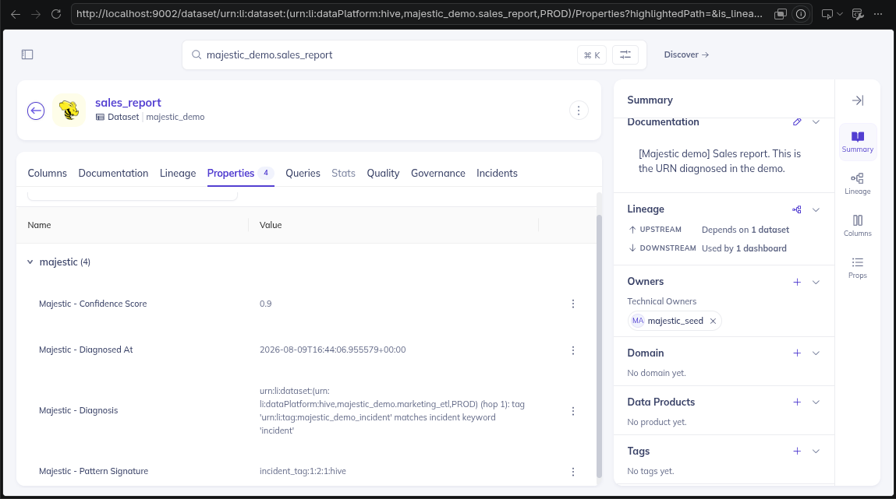

# Examples

Devpost's submission checklist asks for `examples/` with **real outputs**:
an actually-generated diagnosis and a screenshot of the structured
property in the DataHub UI.

## What these files are

**Current state (2026-08-08, post-translation pass):** the files in this
folder right now were regenerated via `scripts/generate_example_outputs.py`
against `FakeDataHub`, not a live instance — the real DataHub quickstart
that ran for most of this session (11+ hours up) started timing out
intermittently while re-validating everything after translating the
codebase to English. The individual commands (`doctor`, `diagnose
--write --explain`, `impact`, `check-change`) were all re-confirmed
working end to end against the real instance during that same pass (see
`README.md` "Technical notes" and the session history) — only the
specific H->G->F memory-reuse seeding hit a transient GMS timeout at that
moment. **Before the final submission/video, regenerate these against a
freshly started real instance** using the exact commands below, replacing
these `FakeDataHub` outputs.

Earlier in the project, these same files WERE generated against a real
DataHub instance (`datahub docker quickstart`), on the graph seeded by
`scripts/seed_demo_data.py` (A->B->C, anomaly in B) and a second entity
with the same pattern signature (H->G->F, seeded by reusing
`_seed_second_matching_entity` from `scripts/generate_example_outputs.py`
against the real client instead of `FakeDataHub`) — that's still the
target process to reproduce.

Exact commands used:

```bash
datahub docker quickstart
python3 main.py doctor
python3 scripts/seed_demo_data.py
python3 main.py diagnose "urn:li:dataset:(urn:li:dataPlatform:hive,majestic_demo.sales_report,PROD)" --write --explain
python3 main.py impact "urn:li:dataset:(urn:li:dataPlatform:hive,majestic_demo.sales_report,PROD)"
# + a second entity (H->G->F) for memory reuse, then:
python3 main.py diagnose "urn:li:dataset:(urn:li:dataPlatform:hive,majestic_demo.finance_report,PROD)"
```

Validating this against a real instance (instead of just
`generate_example_outputs.py`'s `FakeDataHub`) found a real bug:
`_seed_second_matching_entity` was trying to emit the `globalTags` aspect
on a `tag` entity (invalid — DataHub rejected it with 422; `FakeDataHub`
doesn't validate aspect/entity compatibility, so it would never have
caught this). Already fixed in `scripts/generate_example_outputs.py`
(uses `TagPropertiesClass`, the way `seed_demo_data.py` already did it
correctly).

## Structured property screenshot



`structured_property_screenshot.png` — captured 2026-08-09 against a live
instance, right after `diagnose --write` ran on
`majestic_demo.sales_report`. Shows the dataset's Properties tab with all
4 `majestic.*` structured properties: confidence score (0.9), the
diagnosed-at timestamp, the full diagnosis text (the causal chain reason),
and the pattern signature. This was the only piece no script could
generate — needed a manual capture.

## How to regenerate

Against an already-running real instance, repeat the commands above and
replace this folder's `.json`/`.txt` files with those outputs.

If a real instance isn't available, `scripts/generate_example_outputs.py`
regenerates an equivalent version by running the same production code
against a fake in-memory graph (`FakeDataHub`) — useful for keeping the
files in sync with the code in the meantime, but it doesn't replace
running this against real DataHub before recording the video.
